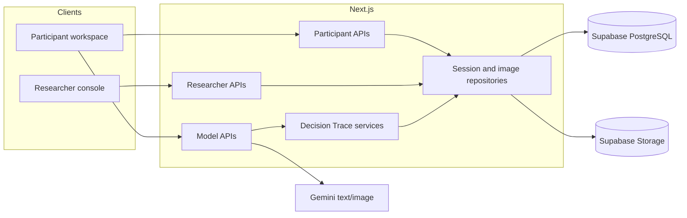
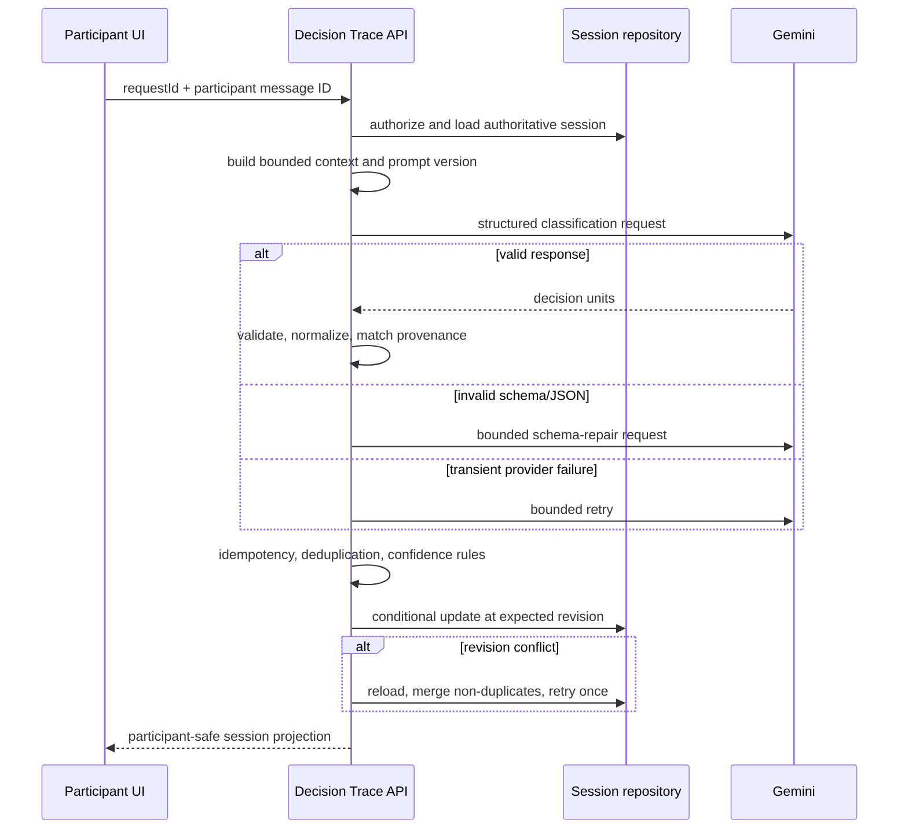

# Architecture

## System boundaries

Decision Trace is a Next.js App Router application with two user surfaces over shared server services. Participant routes expose only the active participant's safe session projection. Researcher routes expose operational records, calibration, and export after separate cookie-based authentication.

## Frontend

React components implement participant entry, pre-task briefing and starting point, the timed creative workspace, generated-image selection, final review, questionnaires, researcher session controls, blinded calibration, and record review. Client hooks coordinate recovery, tab ownership, remote persistence, and conflict states.

## API routes and services

App Router handlers validate request size and shape, authorize the caller, and delegate to server services. Core endpoints cover session creation, participant token exchange, participant session read/write, researcher access and records, chat, image generation/delivery, and Decision Trace classification. Business rules remain in `services/`; server-only model, authentication, storage, and repository code lives in `services/server/`.

## Session and access model

A researcher creates a session through an authenticated route. Balanced assignment is performed by a PostgreSQL function, not trusted to the browser. The participant exchanges a high-entropy access token; only its hash is stored. The server then issues a signed participant cookie bound to a public session ID. Researcher authentication uses a separate PIN and signed cookie with an eight-hour maximum lifetime.

Participant responses use `participantSafeSession`, which withholds the assigned condition and non-visible decision records. Model endpoints re-authorize the cookie against the claimed session and load authoritative server state before constructing prompts.

## Decision Trace pipeline

The classifier separates candidate extraction from validation and persistence. Proposition text is normalized into stable deduplication keys. Decision idempotency keys bind session, participant message, category, action, object, evidence, and source references. Confidence below 0.65 becomes uncertain; only qualifying high-confidence units are participant-visible, while intermediate results are routed to researcher review.

Prompt, provider, model, attempt, latency, error-stage, retry-reason, and final-resolution metadata remain attached to classification records. Hidden model reasoning is neither requested for display nor persisted as a Decision Trace field.

## Optimistic concurrency

`study_sessions` and calibration workspaces carry integer revisions. Updates include both record ID and expected revision in the SQL predicate. A missing updated row is a conflict rather than a silent overwrite. Participant clients expose conflict state for recovery. Trace and image commits reload the latest record and merge only records not already identified before a bounded retry.

## Image pipeline

Image requests are authorized against authoritative session limits. Generated bytes are validated and committed to object storage with metadata in `generated_images`. Request IDs and image IDs support resumable commits and prevent duplicated session records. Participant image reads verify ownership before returning stored content.

## Persistence

Supabase/PostgreSQL stores session envelopes, generated-image metadata, calibration state, and condition-assignment blocks. JSON session state retains the research event model while relational columns support access, lifecycle, revision, and assignment queries. Row-level security is enabled; server repositories use secret credentials and client code receives only publishable settings.

## Export pipeline

Researcher-only UI actions construct formatted JSON and CSV exports from the current session. JSON uses a denylist replacer for credentials, authorization headers, raw provider responses, access tokens, cookies, and signed/public storage URLs. Decision CSV includes model outputs, provenance, review state, prompt version, attempt resolution, and human-coding fields. Exports are generated on demand and are not stored in this repository.

## Failure handling

- Invalid payloads and oversized requests return explicit 4xx responses.
- Authentication failures do not disclose whether another session exists.
- Provider timeouts, rate limits, service interruptions, schema errors, and context errors map to stable failure codes.
- Pending classifications expire instead of remaining indefinitely active.
- Local recovery supports interrupted clients but cannot override server authorization or revision checks.
- Export integrity checks reject known sensitive field classes.

## Security boundaries

Gemini keys, Supabase secret/service-role keys, researcher PINs, and cookie secrets are read only on the server. Public environment variables contain publishable configuration and questionnaire destinations. Production deployments should add platform-level rate limiting, audit retention, secret rotation, and approved research-data governance.
