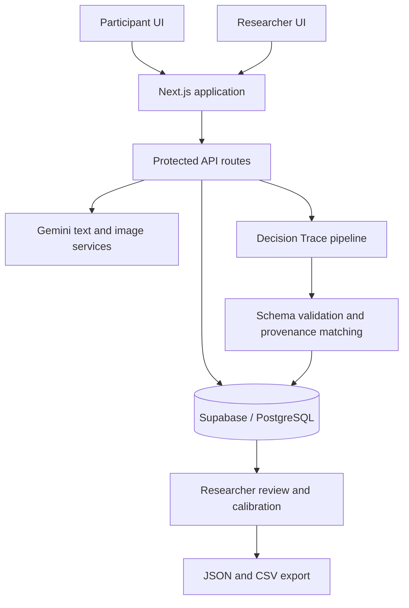

# Decision Trace AI System

A full-stack research platform for studying decision transparency in AI-assisted creative workflows.

Built with Next.js, React, TypeScript, Gemini text and image APIs, and Supabase/PostgreSQL. The repository demonstrates structured model-output validation, revision-aware persistence, access boundaries, failure recovery, research exports, and a 279-test Node suite.

## Screenshots

<!-- Add portfolio screenshots to docs/images/ using home.png, participant-session.png, decision-trace.png, researcher-review.png, and export.png. -->

## Overview

The application supports a controlled study in which participants develop a creative direction with an AI assistant. It records interaction context, extracts atomic decision units, classifies how each decision relates to AI suggestions, matches provenance, persists revisioned session state, and provides protected researcher review and export tools.

## Why It Exists

Conventional chat logs show what was said but not how a participant accepted, modified, rejected, or independently introduced a creative choice. Decision Trace captures that intermediate structure without treating model labels as ground truth or scoring creative quality.

## Core Workflow

1. A researcher creates a study session; server-side balanced assignment determines the study condition.
2. A participant exchanges an access token for a signed session cookie and completes the configured pre-task flow.
3. The participant works in the AI-assisted creative workspace; text, image, board, and lifecycle events are recorded.
4. Participant turns are processed by the Decision Trace pipeline when tracing is enabled.
5. Session updates use revision-aware writes so stale clients cannot silently overwrite newer state.
6. Authenticated researchers review session records, calibrate classifications, and export JSON or CSV data.

## System Architecture



Both participant and researcher interfaces use the same server-side repositories, but expose different session projections and authorization requirements.

## Decision Trace Pipeline

```text
Interaction context
  -> candidate decision extraction
  -> structured Gemini response
  -> schema validation
  -> proposition normalization
  -> source/provenance matching
  -> idempotency and duplicate checks
  -> confidence thresholding
  -> revision-aware persistence
  -> researcher review
```

The pipeline records its prompt version and attempt diagnostics. Invalid JSON or schema output receives a bounded schema-repair attempt; transient provider failures receive a bounded retry. Exhausted attempts become explicit failure records. Decision idempotency keys and normalized proposition keys prevent repeated events from creating duplicate records.

## Reliability and Failure Handling

- Optimistic concurrency compares an expected revision before each update and returns HTTP 409 for stale writes.
- Trace persistence retries a conflict by reloading current state and merging non-duplicate decisions, propositions, and classification records.
- Provider, schema, context, timeout, and incomplete-response states are represented explicitly.
- Request-size, message-count, and image-generation limits are enforced server-side.
- Local recovery state supports interrupted participant sessions without bypassing the authoritative server record.
- Image commits are designed to resume without duplicating generated-image records.

## Researcher and Participant Boundaries

Participant access uses a one-time session token exchange followed by a signed, HTTP-only session cookie. Participant API routes return a restricted session DTO and verify session ownership before model requests or writes. Researcher routes require a separately signed researcher cookie created after PIN verification. Researcher listing, editing, calibration, and export views are not exposed through participant endpoints.

## Data Model

Supabase migrations define:

- `study_sessions`: public session ID, access-token hash, condition flag, study/session status, revision, timestamps, and JSON session state.
- `generated_images`: request-linked image metadata and storage references.
- `calibration_workspaces`: revisioned researcher calibration state.
- `condition_assignment_blocks`: server-side balanced condition assignment.

Row-level security is enabled. Server-only repositories use Supabase secret credentials; browser code receives only publishable configuration.

## API and Services

The App Router exposes participant session exchange/read/write routes, researcher authentication and session routes, Gemini chat, image generation and delivery, decision-trace classification, and server-side session creation. Route handlers validate input and delegate to services and repositories rather than embedding persistence logic in UI components.

## AI Integration

Gemini supports text assistance, image generation, and structured Decision Trace classification. Model responses are not persisted directly: the server validates structure, normalizes propositions, applies provenance and confidence rules, and records provider/model/prompt versions plus attempt outcomes. A mock text pathway supports deterministic development behavior; Supabase and live model credentials are still required for the complete remote workflow.

## Export and Research Data

Authenticated researcher views generate session JSON, session-summary CSV, and decision-level CSV. JSON serialization removes known credentials, authorization data, raw provider responses, signed URLs, cookies, and access tokens. This public repository contains only synthetic demo records; it does not include study exports or participant data.

## Tech Stack

Next.js 16 · React 19 · TypeScript · Gemini API · Supabase/PostgreSQL · Node test runner · ESLint · GitHub Actions

## Project Structure

```text
app/                 Next.js pages and API routes
components/          Participant and researcher interfaces
data/                Study configuration and synthetic demo session
services/            Decision Trace, session, export, and client services
services/server/     Gemini, authentication, storage, and repositories
supabase/migrations/ PostgreSQL schema and condition assignment
tests/               Unit, contract, reliability, and workflow tests
scripts/             Environment diagnostics and secret scanning
docs/images/         Portfolio screenshot location
types/               Domain and generated database types
```

## Running Locally

Requirements: Node.js 20.9+ and pnpm 11.9.

```bash
cp .env.example .env.local
pnpm install --frozen-lockfile
pnpm dev
```

Open `http://localhost:3000`. Apply the SQL files in `supabase/migrations/` to a development Supabase project before exercising remote session flows.

## Environment Variables

`.env.example` documents the exact configuration. Gemini and Supabase secret keys, researcher credentials, and cookie secrets are server-only. Questionnaire destinations are environment-configured so study-specific form URLs are not committed.

## Testing

The repository has 26 test files containing 279 executable tests using Node's built-in test runner. Coverage includes condition assignment, authentication boundaries, participant recovery, revision conflicts, idempotency, proposition deduplication, structured trace validation, retry/repair behavior, image parsing and persistence, questionnaires, calibration, exports, and environment safeguards.

```bash
pnpm test
pnpm typecheck
pnpm lint
pnpm build
pnpm scan:secrets
```

## CI

GitHub Actions installs the frozen pnpm lockfile and runs type checking, linting, tests, and a production build using non-secret placeholder configuration.

## Limitations

- The complete workflow depends on configured Gemini and Supabase services.
- Decision classification remains probabilistic and requires researcher review.
- The provenance model uses bounded conversational context rather than reconstructing every possible influence.
- The system is a research prototype; operational monitoring, institutional deployment controls, and long-term data-retention tooling are outside this repository.

## Responsible Use

Gemini output is validated before persistence, and confidence values are not treated as ground truth. The system studies AI-assisted decision-making; it does not score participants' creativity, authorship, or ability. Research deployments require appropriate consent, access control, retention policies, and human review.

## Author

Yi Xin Ding
